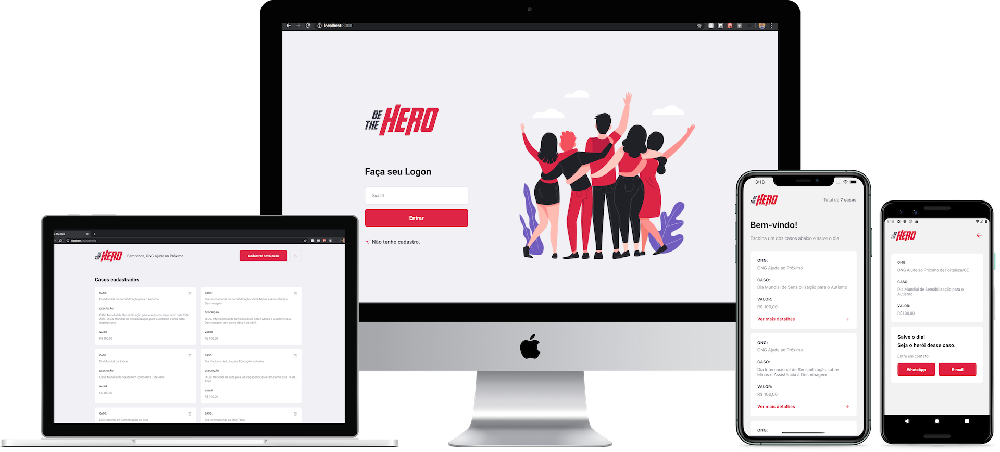

<h1 align="center">
    
    <p>
     
    </p>
</h1>


## 💻 Projeto

A proposta é de um projeto que visa conectar pessoas que desejam fazer contribuições monetárias a ONG's (Organizações não governamentais) que precisam de ajuda.

## :rocket: Tecnologias

Esse projeto foi desenvolvido com as seguintes tecnologias:

#### NodeJs

- express
- nodemon
- knex
- sqlite3
- cors
- celebrate
- cross-env
- jest
- supertest

#### ReactJs

- axios
- react-icons
- react-router-dom
- react-toastify

#### React Native (Expo)

- axios
- expo-constants
- expo-mail-composer
- intl

## :information_source: Como usar
```bash
# Clone o repositório
$ git clone https://github.com/DanAraujjo/semana-omnistack11-be-the-hero/
$ cd semana-omnistack11-be-the-hero

## Servidor
$ cd server
# Instale as dependências
$ yarn install
# Inicie o projeto
$ yarn start

## Web
$ cd web
# Instale as dependências
$ yarn install
# Inicie o projeto
$ yarn start

## Mobile
$ cd mobile
# Instale as dependências
$ yarn install
# Inicie o projeto
$ yarn start
```
## 🤔 Como contribuir

- Faça um fork desse repositório;
- Cria uma branch com a sua feature: `git checkout -b minha-feature`;
- Faça commit das suas alterações: `git commit -m 'feat: Minha nova feature'`;
- Faça push para a sua branch: `git push origin minha-feature`.

Depois que o merge da sua pull request for feito, você pode deletar a sua branch.
